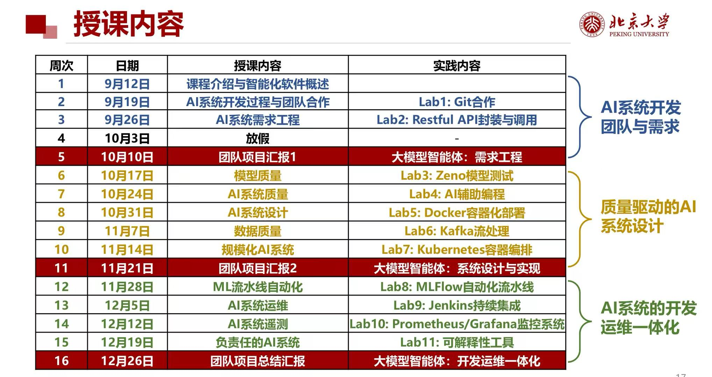
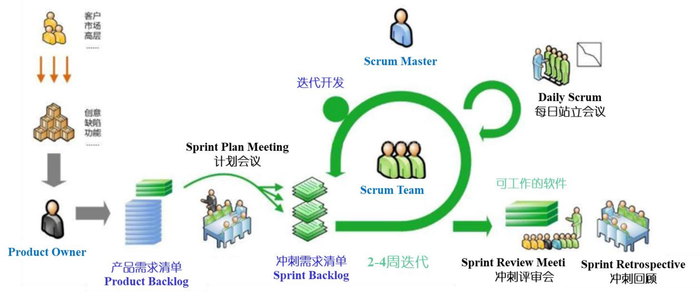
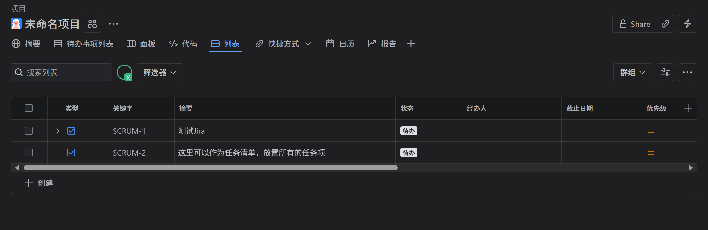

# 团队公约

> 一起学习，共同进步!
—— —— 版本V1.0(拟案)

---

## 修改公约

+ **版本命名**

小改动（基本对齐原版本）增加版本号的小数位，e.g. V1.0 -> V1.1

大改动（基本不兼容原版本）增加版本号的整数位，e.g. V1.1 -> V2.0

未经所有人认可的版本提案要加上后缀`(拟案)`

+ **修改方法**

**总则**：所有组员都拥有调整公约的权利，所有的修改都应该得到**全体组员的认同**才可落实

**流程**：提出新一版公约（指明变动）-> 询问所有人意见（应公开） -> 若全通过，则更新现行公约版本，否则应重新草拟，回到流程开始

**如何发表意见**：利用群组/会议沟通，或使用红色的字来写下你对某些公约的意见，参考<inline style="color:red">这是一行意见</inline>

---
## 工作公约

### 工作沟通约定

#### 总则
+ 积极交流沟通
+ 及时求助
+ 事事有回应

#### 微信聊天群
1. 平时交流
2. 任务量小的作业
3. 临时聊天：不作阅读要求
4. 重要聊天：需要部分/全体小组成员阅读的重要信息，通过 **@或公告形式** 发放
5. **重要聊天：要求涉及的成员进行阅读和应答**
5. 无特殊情况，**应即日回复**有关自己的工作消息，处于繁忙状态（期中期末复习/在赶别的ddl）需提前或及时告知组员
6. 在冲刺周期内，组长具有群管理员权限

#### 线下/线上会议
1. 任务量大的作业
2. 尽量约时间线下交流
3. 负责该任务的所有成员都应该**准时出席参与**

### 工作模式

#### 工作流程

预期每周都会有新的小组作业，每个作业大概有一周时间。

我们可以效仿scrum敏捷开发模型，把每次 $[作业发布, DDL]$ 当作一个冲刺周期。

1. **冲刺计划会议**
    + 时间：作业刚发布
    + 目标：确认**冲刺需求清单**、分工并作出**承诺**（即说明时间预算）
2. **冲刺阶段** 
    + 时间：计划会议后 ~ DDL前
    + 目标：完成冲刺需求清单
    + 冲刺过程中需要同步更新自己的**任务状态**（进行中、待审查、完成、etc.）
    + 组长视情况可进行工作调度和需求调整
3. **站立会议**
    + 时间：冲刺阶段中
    + 目标：**同步项目情况**，交代所遇疑难，以便及时调整
    + 形式建议：组长可以群里给出冲刺进展概览(e.g. 燃尽图、SCRUM面板)，参与冲刺的各成员简单交代进度和**目前被卡住的困难**
    + 冲刺周期内**至少展开一次**，可以安排在周期中段，时间和频率由组长决定
4. **冲刺评审会**
    + 时间：赶完DDL了
    + 目标：总结 -> 经验
    + 组长总结本周期的任务完成状况，对于整个周期工作 理想/不理想 的地方发表一下意见
    + 组员可对组长发表意见
    + 讨论目前工作是否存在什么潜在问题需要调整

**备注：** 此处只是设想，以上scrum工作模式未必适合所有工作阶段，如果任务量不大 / 分工不复杂，例如做汇报 / 需求分析，可以考虑切换到更灵活的工作模式。

**谁来当组长(Scrum Master)？**
+ 轮流组长制
    + 组长候选人：学期初进行意向统计，有意体验组长的组员都被纳入此名单
    + 民主参与：如果有组员完全不想当组长(只想当Geek)也是没问题的，那就不纳入到组长候选人里面
    + 每个周期从组长候选人中确定一位组长，可以用讨论协商或随机方式决定
    + 轮次平均：假设有10个冲刺周期，如果5个人都想体验组长的话，则认为每人都当两次组长（无特殊情况）
+ 组长の任务
    + 发群公告和帮忙@all
    + 对本次冲刺任务有big picture：知道每部分要做什么，预期的成品什么样
    + 调控整体冲刺周期：应该掌握各分工情况、提供帮助、适当调度人手
    + 明确冲刺周期中的关键时间节点：制定内部ddl、站立会议时间等
    + 主持三个会议（计划、站立、评审）
    + 召开三个会议（决定会议形式、时间、地点）
    + 对PR进行Code Review和Merge（注意：组长不义务Solve Conflict，组员应该先解决了Conflict才发起PR）
+ 组长の福利:
    + 分工时有优先选择权（如果任务量小，可以选择不认领清单任务）
    + 在位期间，所有投票中组长的票都值1.5票，如果在位期间没有使用，可以留到后面的某次投票使用
    + 在位期间的经费管理权（合适时机可饭聚/团建）
+ 弹劾：
组长做得实在太差，结果被两位成员联合弹劾并得到第三位成员认同，立即退位并惩罚以后只能当Geek，票选/商议/随机决定新组长接替工作。
坏组长的行为例如：
    - [ ] 无故不 召开/主持 会议（任意一个）
    - [ ] 因懈怠等原因对冲刺情况不掌握以致负面影响团队（赶不上ddl / Merge PR的时候造成灾难性后果）
    - [ ] 人身攻击组员
    - [ ] 两天不回消息
    - [ ] 贪污

#### 追踪机制

+ 利用一种平台记录整个学期的进度，每次分完工后也可将分工结果记录在这里

用Jira能实现。不用翻墙，微软账号注册即可。

[加入我们的开发团队](https://pku-aisoftware.atlassian.net/jira/software/projects/SCRUM/summary)

点击展开Jira的使用介绍

设置总的任务清单和编排冲刺清单

追踪单次冲刺的任务进展

开会总结可能用到的图表

可以用来记录DDL、团建日期、冲刺阶段等

可以检阅所有已完成/未完成任务

#### 代码协作方式（待完善）

##### 不知道用哪种就用第一种吧（推荐）

##### 模式一：fork + feature-branch + PR，保守协作
当作自己不是Co，不具有团队仓库的push权限，采用fork -> new branch -> PR的方法。

适用场景：
+ 大修改 / 重要修改 / 风险修改 时请务必（避免手一滑push上去了）
+ 需要把自己本地的main分支更新到团队仓库，即直接改动main分支时（例如你尝试了把自己的feature分支merge到main之后）

##### 模式二：feature-branch + PR，一般协作
直接在团队仓库基础上新建feature分支，本地向feature push好后发起PR (feature -> main)

适用场景：
+ 模式一、三之间

##### 模式三：不在意Peer Review
在模式二的基础上去掉PR，改为直接的merge（甚至不建立feature branch），自行处理好冲突就push到团队仓库的main里面

适用场景：
+ 只在你的修改无关紧要时使用（e.g. 新增不影响原仓库工作的文件、修改.md里面的一些文字）

当你需要做回退操作时，请使用revert或cherry-pick，尽量避免reset

### 其他约定
+ 不做DDL战士，设置组内ddl指标，最好提前ddl至少半天

---

## 组内评核机制（待定）

目标是施以可量化的约束()

为了避免有恶意差评，建议采用公审制度（群内/线下会议公开审判）

>A君：提案 B存在已读不回的问题
C君：确实
D君：不知道没私戳过
E君：支持
A君：B有没有异议
B君：抱歉 抱歉 这段时间太忙了 我经常意念回复后就忘记了，大家见我没回可以多dd我或者语音我，之后不会这样了TT
A君：大家选择原谅吗
C君：可以
E君：知错能改善莫大焉

既然有三次的团队汇报，也许可以每次汇报结束后来一次？

可以采取扣分制）

参考扣分项：
- [ ] 开会无故缺席
- [ ] 开会挂机
- [ ] 一天不回消息
- [ ] 不配合组长工作
- [ ] 当组长时实施了暴政
- [ ] 未沟通就错过内部截止日期
- [ ] 未及时沟通而未完成约定任务

---

## 技术规范公约

### 写程序

+ 常量命名
+ 变量命名
+ 函数命名
+ 类命名
+ 接口规范

---

## 其他公约

---

# 团建活动
## 总则：多多团建，利用好经费

（起码凑够X人才能算是团建?）

团队兴趣爱好云：
+ 运动
+ 网球
+ 足球
+ 篮球
+ 徒步
+ 金庸小说
+ 老电影
+ 桌游
+ 干饭
+ 音乐
+ 麻将
+ 动漫
+ 乒乓球
+ 设计
+ 羽毛球
+ 老歌
+ 折纸
+ KTV